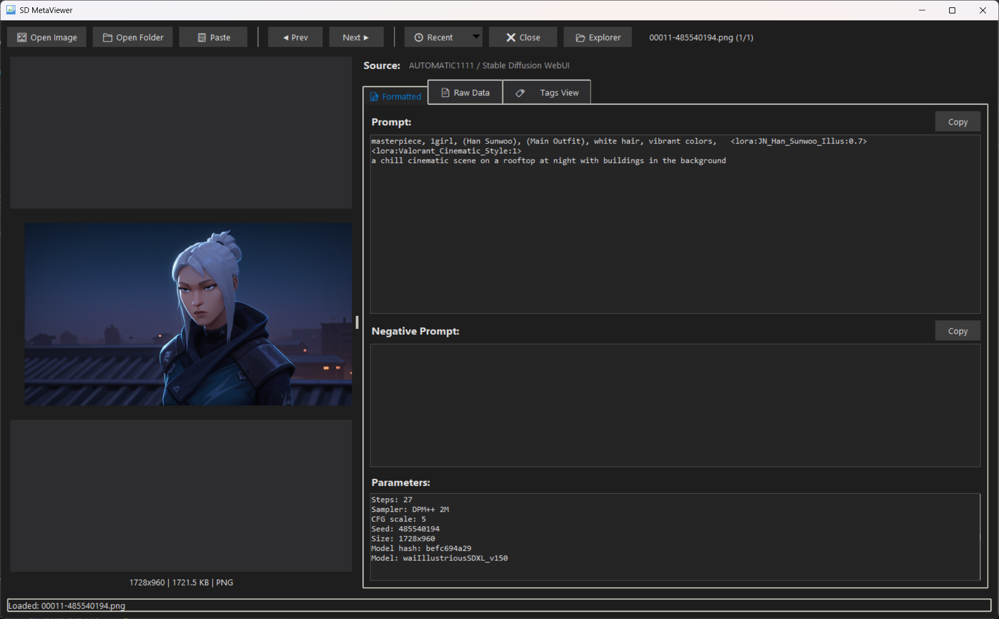

# SD MetaViewer

A lightweight, native Windows application for viewing metadata from AI-generated images (Stable Diffusion, NovelAI, ComfyUI, etc.) and photos. This project was mostly done using Claude Opus 4.5 available in GitHub Copilot. 



## Features

- **🖼️ Drag & Drop Support** - Simply drag any image onto the window
- **📋 Easy Copy** - One-click copy for prompts and parameters
- **🔍 Multiple Views** - Formatted, Raw Data, and Tags View for easy reading
- **📁 Folder Browsing** - Browse images in a folder with grid view
- **⏮️ History Navigation** - Browse through previously viewed images
- **🕒 Recent Images** - Quick access to recently viewed images
- **🌙 Dark Mode** - Automatically follows Windows theme (light/dark)
- **📱 Native UI** - Clean, modern Windows look and feel
- **⚡ Fast Loading** - Loads metadata in milliseconds
- **🎨 Right-Click Menus** - Context menus for copy/paste operations
- **📋 Clipboard Paste** - Paste images directly from clipboard
- **🔎 Model Detection** - Detects model architecture (SDXL, Flux, Pony, Illustrious, etc.)
- **📷 Camera Info** - Displays EXIF data (camera, lens, exposure, GPS location)
- **🤖 AI Detection** - Identifies images from ChatGPT/OpenAI, Google Gemini
- **🎨 Editing Detection** - Detects if images were edited with Photoshop, GIMP, etc.

## Supported Formats

### AI Image Generators
- **AUTOMATIC1111 / Stable Diffusion WebUI** - Full parameter extraction
- **ComfyUI** - Workflow and node parsing (including z-image prefix detection)
- **NovelAI** - Comment and description metadata
- **ChatGPT / OpenAI** - DALL-E and GPT-4o generated images (via C2PA metadata)
- **Google Gemini** - AI-generated images (via XMP metadata)

### Photos & Edited Images
- **Camera EXIF** - Make, model, lens, exposure settings, GPS location
- **Editing Software** - Adobe Photoshop, Lightroom, GIMP, Affinity Photo, and more
- **Generic PNG/JPEG/WebP** - Any embedded text metadata

## Model Architecture Detection

Automatically detects and displays:
- Flux.1 Dev / Schnell
- SDXL
- Pony Diffusion
- Illustrious XL
- SD 1.5 / SD 2.1 / SD 3
- Cascade, PixArt, AuraFlow, and more

## Project Structure

```
sd_metaviewer/
├── src/                    # Main package
│   ├── __init__.py         # Package info
│   ├── app.py              # Main application UI
│   ├── extractor.py        # Image metadata extraction
│   ├── parsers.py          # Metadata format parsers
│   └── utils.py            # Utility functions
├── run.py                  # Main entry point
├── build.bat               # Build single executable
├── build_folder.bat        # Build folder distribution
├── Run_SDMetaViewer.bat    # Run from source
├── requirements.txt        # Python dependencies
├── pyproject.toml          # Project configuration
└── README.md               # This file
```

## Requirements

- Python 3.8+
- Pillow (image processing)
- windnd (drag-and-drop on Windows, optional)

## Installation

### From Source

1. Clone or download this folder
2. Install dependencies: `pip install -r requirements.txt`
3. Run: `python run.py` or double-click `Run_SDMetaViewer.bat`

### Building an Executable

**Single File (slower startup, easier to share):**
```batch
build.bat
```
Creates: `dist/SD MetaViewer.exe`

**Folder Distribution (faster startup):**
```batch
build_folder.bat
```
Creates: `dist/SD MetaViewer/SD MetaViewer.exe`

## Usage

1. **Open an image**:
   - Drag & drop an image onto the window
   - Click "Open Image" button
   - Use Ctrl+O
   - Paste from clipboard (Ctrl+V)

2. **Browse a folder**:
   - Click "Open Folder" to select a folder
   - View thumbnails in grid view
   - Use F5 to toggle grid view

3. **View metadata**:
   - **Formatted** tab: Clean view of prompt, negative prompt, and parameters
   - **Raw Data** tab: Complete JSON metadata
   - **Tags View** tab: Easy-to-read tag format with color coding

4. **Copy metadata**:
   - Click "Copy" buttons next to each section
   - Right-click on any text area for context menu

5. **Navigate**:
   - Use "Previous" / "Next" buttons below the image
   - Use arrow keys (← / →) for quick navigation
   - Use "Recent" menu for quick access to history
   - Press F5 to toggle grid view in folder mode

## Keyboard Shortcuts

| Key | Action |
|-----|--------|
| Ctrl+O | Open file |
| Ctrl+C | Copy prompt |
| Ctrl+V | Paste from clipboard |
| ← / → | Navigate previous/next |
| F5 | Toggle grid view |
| Escape | Close grid view |

## Camera & Photo Metadata

For photos, SD MetaViewer displays:
- 📷 Camera make and model
- 🔭 Lens information
- ⚡ Exposure settings (shutter speed, aperture, ISO, focal length)
- 💡 Flash mode
- 🎨 White balance and color space
- 📍 GPS location with Google Maps link
- 📅 Date taken
- 👤 Artist and copyright info

## Size & Performance

- **Application Size**: ~50 KB (Python scripts)
- **Dependencies**: ~5 MB (Pillow)
- **Compiled Size**: ~15 MB (single exe)
- **Launch Time**: < 1 second
- **Metadata Loading**: < 100ms

## License

MIT License - Free for personal and commercial use.
